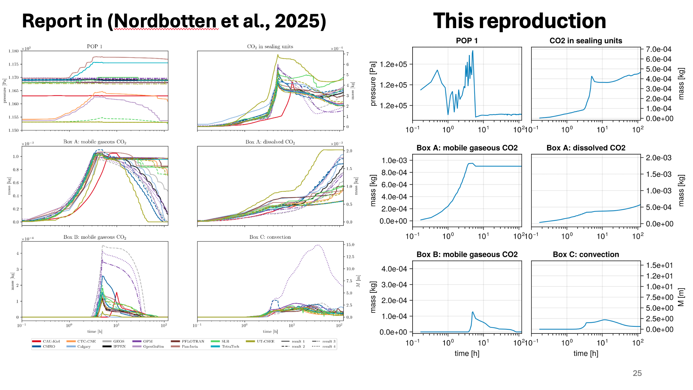

# SPE11A in JutulDarcy

This setup is my attempt to reproduce the [SPE11A](https://spe.org/en/csp/spe11/) simulation with the [JutulDarcy]( https://github.com/sintefmath/JutulDarcy.jl) simulation toolkit.

I configured this setup within a single day with substential usage of LLM Agents having no prior Julia or JutulDarcy experience, so it should **not** be viewed neither as a showcase of JutulDarcy capabilities, nor instructions about the right ways of setting up simulations there.

The simulation deck data is generated with [pyopmspe11](https://github.com/OPM/pyopmspe11). The simulation runs on the reporting grid.

# Known limitations
- `dispersion` keyword from the deck is ignored.

# Run it

Generate the deck before running this script (you need `uv` installed):
```
cd spe11a_data && uv run pyopmspe11 -i input.toml -m deck -o output
```

You need JutulDarcy installed: https://github.com/sintefmath/JutulDarcy.jl

The JutulDarcy git commit the script is tested with: `f863de78d6ec946bb046f8a967e6ebb14ddab3a9`. Assuming that JutulDarcy folder is in the parent directory:
```
julia --project=../JutulDarcy.jl
```

Before running the simulation, install dependencies in Julia REPL: 
```
import Pkg
Pkg.add("HYPRE")
Pkg.add("GLMakie")
Pkg.add("SpecialFunctions")
```

Run the simulation:
```
import("spe11a.jl")
```

After the simulation is finished, it reports sparse data and animates solution.

# Results

The figure compares this reproduction with the results reported by the participants in the SPE11 comparative study (Nordbotten et al., 2025). Most quantities of interest fall within the range of the participants' results and show the same qualitative behavior, including the timing of the CO₂ breakthrough into Box B and the sealing units. The exception is the pressure at observation point POP 1, which is higher than the reported range.

